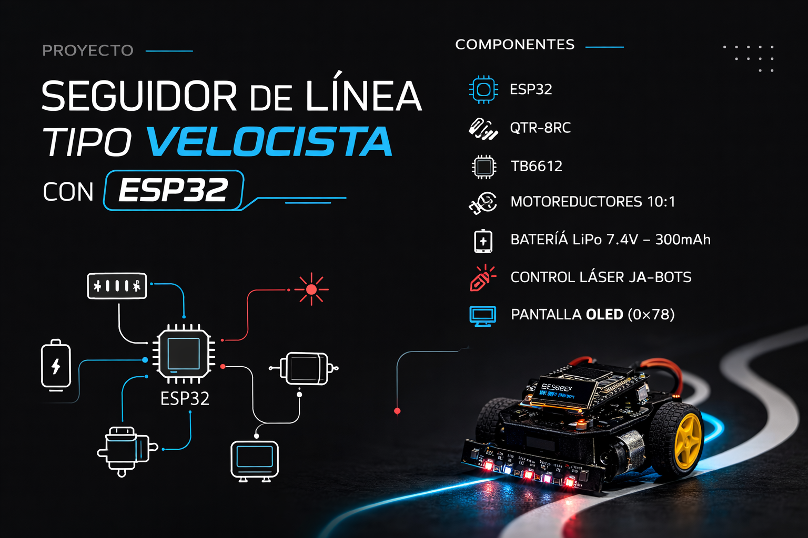

# Proyecto de Aula – Seguidor de Línea Tipo Velocista con ESP32

  

<em>Propuesta visual del robot seguidor de línea tipo velocista desarrollado con ESP32.</em>

---

## 📘 Introducción

En el auge de la cuarta revolución industrial, los sistemas embebidos forman parte fundamental de numerosos dispositivos tecnológicos que facilitan el día a día, salvan vidas y aportan al desarrollo global. Un sistema embebido es un dispositivo diseñado para realizar una o pocas funciones específicas, generalmente dentro de un sistema electrónico o mecánico de mayor tamaño. Los microcontroladores se utilizan como el componente central de estos sistemas, ya que integran en un solo circuito las diferentes partes que lo componen. Éstos son capaces de recibir información, procesarla mediante algoritmos programados y generar señales de control para actuadores como luces o motores.

Por la capacidad de percibir su entorno, tomar decisiones basadas en esa información y ejecutar acciones sin intervención humana, los microcontroladores son ideales para controlar sistemas autónomos.

Un ejemplo de este tipo de aplicación es el carrito seguidor de línea, objeto de este proyecto, en el cual un microcontrolador procesa la información proveniente de sensores que detectan una línea marcada en el suelo, y a partir de esta entrada, controla la velocidad y dirección de los motores para mantener la trayectoria establecida. De esta forma, el sistema embebido permite que el carrito se desplace de manera autónoma al mismo tiempo que es capaz de comunicarse con el usuario para brindar información sobre su estado. Los robots de navegación autónoma tienen diversas aplicaciones en diferentes campos, por lo que resulta pertinente diseñar un sistema embebido encargado de la integración entre sensores, procesamiento y actuadores sin intervención humana.

---

## 🎯 Objetivos

### Objetivo General
Diseñar e implementar un sistema embebido autónomo basado en ESP32 capaz de seguir una línea mediante sensores infrarrojos, integrando telemetría inalámbrica en tiempo real para la supervisión remota del sistema, cumpliendo con buenas prácticas de ingeniería de firmware en cuanto a arquitectura, manejo de errores, logging y trazabilidad de requisitos.

### Objetivos Específicos
Implementar el módulo de sensado mediante un arreglo de sensores infrarrojos (IR) para la detección continua de la línea guía, definiendo rangos de operación válidos y manejo de errores ante lecturas fuera de rango o fallos de sensor.

Implementar la capa de comunicaciones del sistema utilizando al menos dos protocolos, aprovechando las capacidades inalámbricas del ESP32 para la transmisión de telemetría.

Construir el módulo de logging con soporte de timestamps, niveles de severidad (INFO, WARN, ERROR), códigos de error estructurados y evidencia funcional durante la demostración.

---

## 👥 Asignación de roles

### Líder técnico (Technical Lead)
**Responsable:** Angela Sanchez  
Encargada de liderar el desarrollo técnico del proyecto, definir la arquitectura general del sistema, coordinar al equipo de trabajo y supervisar la integración final entre hardware y firmware.

### Ingeniero de integración de hardware (Hardware Integration Engineer)
**Responsable:** Simon Patiño  
Encargado del diseño e integración física del sistema, interconexión de componentes electrónicos, ensamblaje del hardware, montaje del prototipo y validación del funcionamiento eléctrico y mecánico.

### Ingeniera de firmware (Firmware Engineer)
**Responsable:** Laura Maya  
Encargada del desarrollo del firmware en la ESP32, implementación de la lógica de control, adquisición y procesamiento de señales de sensores, control de actuadores, organización del software embebido y soporte a la capa de comunicaciones.

### Ingeniero de verificación y pruebas (Verification & Testing Engineer)
**Responsable:** Jeronimo Zapata  
Encargado del diseño y ejecución del plan de pruebas, verificación del cumplimiento de requisitos, recolección de evidencias experimentales y apoyo en la construcción de la matriz de trazabilidad y validación.

---

## 🤖 Descripción del proyecto

Este proyecto consiste en el diseño e implementación de un robot seguidor de línea tipo velocista basado en una **ESP32**, capaz de desplazarse de manera autónoma sobre una pista marcada. El sistema debe detectar continuamente la línea, calcular su posición relativa respecto al robot y corregir la trayectoria en tiempo real mediante el control diferencial de sus motores.

Además del seguimiento de línea, el proyecto incorpora una **capa de telemetría inalámbrica** para supervisar remotamente variables relevantes del sistema y un **módulo de logging** que registre eventos importantes con timestamps, niveles de severidad y códigos de error estructurados.

El desarrollo se plantea bajo buenas prácticas de ingeniería de firmware, incluyendo arquitectura modular, manejo de errores, trazabilidad de requisitos y validación experimental del prototipo.

---

## ⚠️ Problema que se desea resolver

El problema central es desarrollar un robot seguidor de línea que no solo sea capaz de mantenerse sobre una trayectoria, sino que también lo haga con rapidez, estabilidad y precisión, características propias de un robot tipo velocista.

Para lograrlo, el sistema debe:

- Detectar la línea de forma continua mediante sensores infrarrojos.
- Procesar esa información en la ESP32 en tiempos muy cortos.
- Ajustar la velocidad y dirección de los motores de manera inmediata.
- Transmitir telemetría inalámbrica para supervisión remota.
- Registrar eventos y errores del sistema para depuración y validación.

Durante la operación pueden presentarse condiciones como pérdida de línea, lecturas inconsistentes, ruido en sensores, fallos de comunicación o respuestas inadecuadas de los actuadores. Por ello, el sistema debe ser capaz de identificar estas situaciones y responder de forma segura.

---

## ✅ Justificación del proyecto

Este proyecto representa una aplicación completa de sistemas embebidos porque integra en un mismo prototipo:

- **Sensado físico real** mediante sensores infrarrojos.
- **Procesamiento local** usando una ESP32.
- **Actuación electrónica** a través del control de motores.
- **Comunicación inalámbrica** para telemetría en tiempo real.
- **Logging estructurado** para eventos, errores y depuración.
- **Buenas prácticas de firmware** como modularidad, trazabilidad y validación.

Además, tiene valor académico y práctico, ya que permite aplicar conocimientos de electrónica, programación embebida, control, integración hardware-software y pruebas experimentales.

---

## 📌 Alcance del proyecto

El alcance de este proyecto comprende el diseño, desarrollo, integración y validación de un robot seguidor de línea tipo velocista en un entorno académico y controlado.

### Incluye
- Integración de sensores infrarrojos para detección de línea.
- Procesamiento y control con ESP32.
- Control de motores mediante un driver adecuado.
- Implementación de telemetría inalámbrica en tiempo real.
- Construcción del módulo de logging.
- Manejo de errores y monitoreo del estado del sistema.
- Ensamblaje del prototipo sobre un chasis funcional.
- Pruebas experimentales sobre una pista.
- Documentación técnica y trazabilidad de requisitos.
---

## 🧩 Tecnologías y componentes principales

- **ESP32:** microcontrolador principal encargado del procesamiento, control y comunicaciones.
- **Sensores infrarrojos reflectivos:** utilizados para detectar la línea y estimar la posición relativa del robot.
- **Driver de motores:** módulo encargado del control de velocidad y dirección de los motores.
- **Motores DC de tracción diferencial:** actuadores principales del sistema.
- **Batería:** fuente de alimentación del prototipo.
- **Telemetría inalámbrica:** transmisión de variables y estados para supervisión remota.
- **Módulo de logging:** registro de eventos con timestamps, severidad y códigos de error.
- **Interfaz de visualización local:** visualización de estados, errores y variables relevantes.

---

## 🚀 Funcionalidades principales esperadas

- Seguimiento autónomo de línea.
- Detección continua mediante sensores infrarrojos.
- Corrección de trayectoria en tiempo real.
- Control diferencial de motores.
- Supervisión remota mediante telemetría inalámbrica.
- Monitoreo del estado del sistema.
- Manejo de errores y eventos.
- Registro estructurado de logs.
- Soporte a pruebas y validación del prototipo.

---
