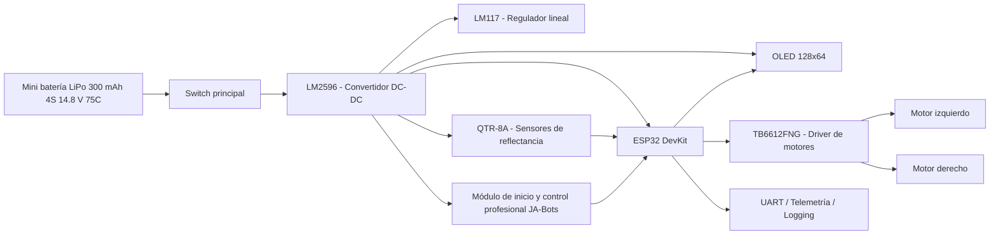

# Entrega – Diagrama de bloques completo del sistema, esquemático eléctrico y detalle de componentes

## Proyecto de Aula – Robot Seguidor de Línea Tipo Velocista con ESP32

**Integrantes:**  
- Angela Sanchez  
- Simon Patiño  
- Laura Maya  
- Jeronimo Zapata  

**Curso:** Sistemas Embebidos  
**Fecha:** [Agregar fecha]  

---

## 1. Introducción

El presente documento corresponde a la entrega del **diagrama de bloques completo del sistema, el esquemático eléctrico y el detalle de componentes** del proyecto de aula denominado **Robot Seguidor de Línea Tipo Velocista con ESP32**.

El sistema desarrollado consiste en un robot autónomo capaz de detectar una línea sobre una pista, estimar su posición relativa y corregir su trayectoria en tiempo real mediante el control diferencial de dos motores DC. Para ello, se emplea una **ESP32** como unidad central de procesamiento, un arreglo de sensores infrarrojos para el sensado de línea, un driver de potencia para el accionamiento de motores, una pantalla OLED como interfaz local y una arquitectura de alimentación regulada para garantizar la estabilidad eléctrica del sistema.

Además, el proyecto contempla capacidades de telemetría, logging y control seguro de arranque mediante un módulo externo de inicio y parada.

---

## 2. Objetivo de la entrega

Presentar de manera estructurada la arquitectura de hardware del sistema, mostrando:

- El diagrama de bloques completo del robot.
- El esquemático eléctrico del sistema implementado.
- El detalle técnico de los componentes principales utilizados en la PCB.

---

## 3. Descripción general del sistema

El sistema embebido está organizado en varios bloques funcionales:

1. **Bloque de alimentación**, encargado de recibir la energía de entrada y distribuir tensiones reguladas a los diferentes módulos.
2. **Bloque de procesamiento**, implementado con una ESP32 DevKit, que ejecuta la lógica de control del robot.
3. **Bloque de sensado**, compuesto por sensores infrarrojos reflectivos que detectan la línea.
4. **Bloque de actuación**, formado por el driver TB6612FNG y los motores DC.
5. **Bloque de interfaz y monitoreo**, conformado por la pantalla OLED y conexiones auxiliares.
6. **Bloque de control de arranque y operación**, implementado con el **módulo de inicio y control profesional JA-Bots**, encargado de habilitar de forma segura la ejecución del robot mediante señales de inicio y parada.

---

## 4. Diagrama de bloques del sistema

### 4.1 Representación conceptual

### 4.2 Explicación del diagrama de bloques

El funcionamiento general del sistema se da de la siguiente manera:

- La energía ingresa desde una **mini batería LiPo de 300 mAh, configuración 4S, 14.8 V, 75C**.
- El switch principal habilita o deshabilita la alimentación del sistema.
- El módulo LM2596 reduce y estabiliza la tensión de entrada.
- El LM117 complementa la regulación para subsistemas específicos.
- La ESP32 recibe las señales provenientes de los sensores reflectivos.
- A partir de dichas señales, la ESP32 calcula la acción de control.
- El driver TB6612FNG aplica esa acción sobre los motores DC.
- La pantalla OLED permite visualizar estados y variables.
- El **módulo de inicio y control profesional JA-Bots** permite implementar una secuencia segura de arranque, habilitación y detención del robot mediante señales externas de control.

---

## 5. Render de la PCB diseñada

La siguiente imagen corresponde al modelo tridimensional de la PCB desarrollada para la integración del sistema:

### 5.1 Observaciones del diseño físico

En la PCB se identifican los siguientes módulos principales:

- **ESP32 DevKit**, montada como unidad central.
- **Convertidor LM2596**, ubicado en la zona izquierda inferior.
- **Conectores de bornera**, destinados a alimentación y conexiones externas.
- **Pantalla OLED**, conectada mediante cabecera dedicada.
- **Capacitores de filtrado**, distribuidos en la placa para estabilización eléctrica.
- **Etapas de conexión para sensores y actuadores**.
- **Espacios de interconexión para driver y periféricos**.

Este diseño permite una integración compacta y ordenada del sistema embebido sobre una sola tarjeta.

---

## 6. Esquemático eléctrico del sistema

### 6.1 Esquemático implementado

### 6.2 Descripción general del esquemático

El esquemático muestra la integración de la fuente de alimentación, la unidad de procesamiento y los periféricos principales del sistema.

Se identifican los siguientes bloques:

- **U1:** ESP32, unidad principal de procesamiento.
- **U2:** Driver de motores.
- **U4:** Etapa de regulación.
- **SW1:** Interruptor de habilitación.
- **OLED1:** Pantalla gráfica.
- **J1, J2, J5, J6, J8:** Conectores para sensores, alimentación y módulos auxiliares.
- **C1, C5 y otros capacitores:** Componentes de filtrado y desacople.

---

## 7. Descripción funcional de conexiones principales

### 7.1 Alimentación

La alimentación principal del sistema proviene de una **mini batería LiPo de 300 mAh, configuración 4S, 14.8 V, 75C**, la cual suministra la energía requerida para el funcionamiento autónomo del robot. Esta energía pasa por la etapa de regulación y filtrado para entregar niveles de tensión adecuados a la ESP32, sensores, pantalla y demás periféricos.

| Bloque | Función |
|---|---|
| Mini batería LiPo 300 mAh 4S 14.8 V 75C | Fuente principal de energía del sistema |
| Switch | Habilitar o desconectar la alimentación |
| LM2596 | Reducir y estabilizar el voltaje |
| LM117 | Ajustar y regular tensión en subsistemas |
| Capacitores | Filtrar ruido y estabilizar la alimentación |

### 7.2 Unidad de procesamiento

La ESP32 actúa como núcleo de control del robot. Desde ella se gestionan las entradas de sensores, las señales hacia el driver de motores, la comunicación con la pantalla OLED y las funciones de monitoreo.

| Módulo | Función |
|---|---|
| ESP32 DevKit | Procesamiento, control y comunicaciones |
| GPIO | Lectura de sensores y control de actuadores |
| UART | Depuración, telemetría y logging |
| ADC | Conversión de señales analógicas provenientes del sensado |

### 7.3 Sensado

El sistema utiliza sensores reflectivos para detectar la línea sobre la superficie de la pista. Estas señales son adquiridas por la ESP32 y usadas para calcular el error de posición.

| Componente | Función |
|---|---|
| QTR-8A | Detectar reflectancia y posición de la línea |
| Entradas ADC de la ESP32 | Leer las salidas analógicas del arreglo de sensores |

### 7.4 Actuación

La acción de control calculada por la ESP32 se transmite al driver de motores, el cual gobierna la velocidad y el sentido de giro de cada motor.

| Componente | Función |
|---|---|
| TB6612FNG | Driver de potencia de doble canal |
| Motor izquierdo | Tracción diferencial |
| Motor derecho | Tracción diferencial |

### 7.5 Interfaz y monitoreo

La pantalla OLED y las interfaces auxiliares permiten visualizar el estado del sistema y facilitar la operación del prototipo.

| Componente | Función |
|---|---|
| OLED 128x64 | Mostrar variables, estados y mensajes |
| UART / Telemetría | Supervisión y depuración |
| Módulo JA-Bots | Habilitación de arranque y control de operación del robot |

### 7.6 Módulo de inicio y control profesional JA-Bots

El sistema incorpora un **módulo de inicio y control profesional JA-Bots**, el cual se utiliza para gestionar la habilitación externa del robot. Este módulo permite implementar una lógica de arranque y parada más segura, facilitando la interacción del usuario con el sistema antes de iniciar el movimiento del prototipo.

Su función principal dentro del proyecto es servir como interfaz de control de operación, enviando a la ESP32 una señal de habilitación o inicio, la cual es interpretada por el firmware para permitir o bloquear la ejecución del algoritmo de seguimiento de línea.

---

## 8. Detalle de componentes

| Componente | Referencia / Modelo | Descripción |
|---|---|---|
| Batería | Mini batería LiPo 300 mAh 4S 14.8 V 75C – JA-Bots | Fuente principal de alimentación del robot. Suministra la energía necesaria para la etapa de potencia y los módulos electrónicos del sistema, permitiendo la operación autónoma del prototipo. |
| Sensor de reflectancia | QTR-8A | Arreglo de 8 sensores infrarrojos utilizado para detectar la posición de la línea mediante salidas analógicas. |
| Pantalla gráfica | OLED 128 × 64 | Módulo de visualización usado para mostrar información básica del sistema, estados y variables de operación. |
| Regulador de voltaje lineal ajustable | LM117 | Dispositivo de regulación de tensión empleado para estabilizar la alimentación de distintos subsistemas electrónicos. |
| Módulo de inicio y control | JA-Bots – Módulo de inicio y control profesional | Módulo encargado de habilitar y controlar el arranque del robot mediante señales externas de inicio y parada. Se integra al sistema como interfaz de control entre el usuario y la ESP32, permitiendo gestionar de forma segura la secuencia de encendido, inicio de movimiento y detención del prototipo. |
| Driver de motores DC | TB6612FNG | Controlador de doble canal utilizado para manejar velocidad y sentido de giro de los motores del carrito. |
| Interruptor | Switch | Elemento de accionamiento manual utilizado para encender, apagar o habilitar la alimentación del sistema. |
| Terminales de conexión | 3 borneras | Conectores usados para enlazar la alimentación, los motores y otros módulos externos de forma segura. |
| Convertidor DC-DC reductor | LM2596 | Módulo encargado de convertir un voltaje de entrada mayor a uno menor y estable para alimentar correctamente la electrónica del sistema. |
| Capacitores electrolíticos | 10 µF (2 unidades) | Componentes pasivos empleados para filtrado y estabilización de la alimentación eléctrica. |
| Placa de desarrollo con microcontrolador | ESP32 DevKit | Unidad central de control encargada de leer sensores, procesar la lógica del seguidor de línea y gobernar actuadores y periféricos. |

---

## 9. Interconexión general del sistema

| Origen | Destino | Propósito |
|---|---|---|
| Mini batería LiPo 300 mAh 4S 14.8 V 75C | Etapa de regulación | Alimentación principal |
| Etapa de regulación | ESP32 | Energía para procesamiento |
| Etapa de regulación | OLED | Energía para visualización |
| Etapa de regulación | Sensores | Energía para sensado |
| Sensores | ESP32 | Lectura de la línea |
| ESP32 | Driver TB6612FNG | Señales de control |
| Driver TB6612FNG | Motores | Movimiento del robot |
| Módulo JA-Bots | ESP32 | Señal de inicio, parada o habilitación |
| ESP32 | UART / Telemetría | Monitoreo y depuración |

---

## 10. Conclusiones

El sistema presentado evidencia una arquitectura de hardware modular y adecuada para la implementación de un robot seguidor de línea basado en ESP32. La integración entre la etapa de alimentación, la unidad de procesamiento, los sensores, el sistema de actuación y la interfaz local permite construir un prototipo funcional y escalable.

La PCB diseñada facilita la organización física del sistema y mejora la confiabilidad de las interconexiones. Por su parte, el esquemático eléctrico permite identificar claramente la relación entre los bloques funcionales y validar la estructura del hardware implementado.

La incorporación del **módulo de inicio y control profesional JA-Bots** fortalece la seguridad operativa del sistema, al permitir una habilitación controlada del robot antes del inicio del movimiento.

En conjunto, el diagrama de bloques, el esquemático y el detalle de componentes constituyen una base sólida para continuar con la integración del firmware, las pruebas funcionales y la validación final del robot.

---
